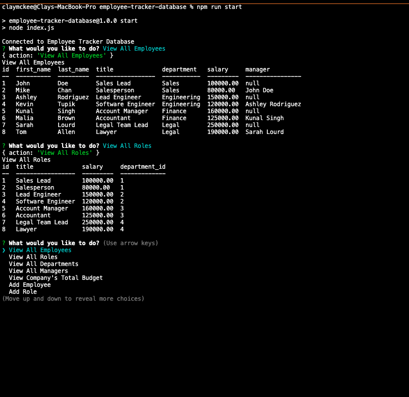

# Employee Tracker Database

## Description

Employee Tracker Database is an terminal command program that allows users to view and interact with information about employees stored in a databse. This interface allows users to view employees, managers, departments, roles, and the company budget; permits users to add employees, departments, and roles; provides the opportunity to update roles and managers for employees; and it even gives you the chance to delete your mistakes!

The program requires users to create and use the database (using mysql in your terminal). Upon running "npm run start", the terminal begins prompting questions through a JavaScript file with functions and Inquirer prompts that allows a user to interact with the database. In order to quit the program, users can go to "Exit" in the prompts.

## Installation

Before running the program, users must run "npm i" to get the packages and node modules. They must also source the schema.sql file. Without any seeds in the database, many of the functions will not work, so the user can alter the seeds.sql file or begin by adding departments, roles, and then employees. 

## Usage

Run "npm run start" and begin following the prompts (after you've finished installation of course!).

## Questions 

 If you have any questions, email me at cmckee120993@gmail.com. 

 You can view more of my work at [cmckee120993](https://github.com/cmckee120993).

## Site in Action

Click on the screenshot above to be taken to a video recording of this project in action.